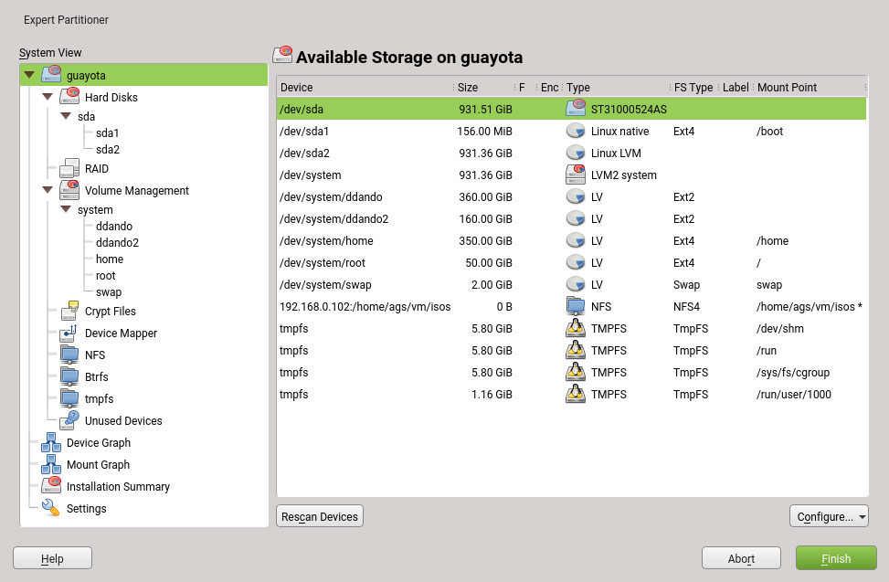
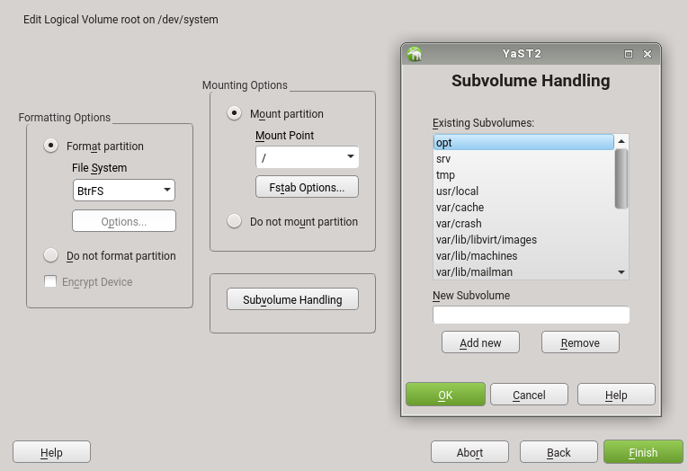
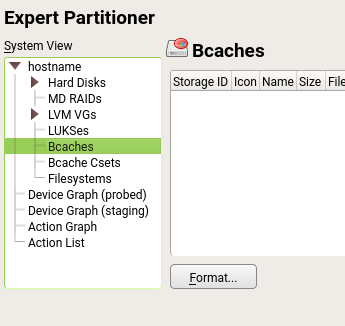

# Expert Partitioner Brainstorming

## Existing GUI Partitioning Tools for Linux

None of the tools in this section offer anything beyond very basic
partition-based operations. In particular,

- no LVM

- no RAID

- no encryption (LUKS etc.)

### GParted

https://en.wikipedia.org/wiki/GParted

### QtParted

https://en.wikipedia.org/wiki/QtParted

### KDE partition manager
  https://en.wikipedia.org/wiki/KDE_Partition_Manager

  

### GNOME disks (gnome-disk-utility)

https://en.wikipedia.org/wiki/GNOME_Disks

## Other Graphical Storage Related Tools for Linux/Unix

### PartedMagic

https://partedmagic.com/

This is little more than a Linux ISO that boots into a desktop with GParted.

### Logical Volume Management (Ubuntu / Red Hat)

https://access.redhat.com/documentation/en-US/Red_Hat_Enterprise_Linux/6/html/Storage_Administration_Guide/s1-system-config-lvm.html

- only LVM, nothing else (no partition management)

- tree based like our expert partitioner

- graphical display: cylinders for logical volumes and physical volumes

- tree branch "uninitialized entities"

- all operations largely based on dialogs with input fields, combo boxes and
  sometimes sliders

### Solaris Volume Manager

http://shrubbery.net/solaris9ab/SUNWaadm/LOGVOLMGRADMIN/p6.html

http://docs.oracle.com/cd/E19253-01/816-4520/

http://docs.oracle.com/cd/E18752_01/html/816-4520/exlwh.html

This tool looks quite promising at first glance, but it's just one huge device
tree starting at "this computer" with a lot of branches that are mostly just
very loosely related to each other.

## Existing Storage-related GUI Tools for Windows and MacOS X

There are many partitioning tools for Windows (and some for MacOS X), but none
of them goes beyond basic partition operations (create, delete, resize, maybe
move). Available RAID tools typically handle RAID only, not partitions;
encryption tools handle only encryption.

There is no counterpart to LVM on Windows. MacOS X introduced that only
recently (called "CoreStorage"), but it is unclear if there are any GUI tools
available for this yet. They seem to try to hide the LVM as well as the
encryption layer from the user.

Bottom line: Both Windows and MacOS X have colorful tools with little
functionality. None of them comes even close to what our Expert partitioner offers.

## YaST Expert Partitioner

Compared with everything else on the market (including Windows and MacOS), the
YaST expert partitioner is the most powerful tool by far.

### Available Views

- <Hostname>
  - Hard Disks
  - RAID
  - Volume Management
  - Crypt Files
  - Device Mapper
  - NFS
  - Btrfs
  - tmpfs
  - Unused Devices
- Device Graph
- Mount Graph
- Installation Summary
- Settings

### New Features

Already requested:

- Create filesystem on disk directly without partition table

- Create LUKS on disk directly

Not requested yet, but forseeable:

- Btrfs as volume manager (Btrfs spanning multiple partitions, very much like
  LVM)

### Ideas

#### Subvolumes Directly Below a Btrfs Partition

Right now, subvolumes are very much hidden: You only see them in the
"installation summary" (proposal) view. Otherwise you'll have to click on a
Btrfs partition and then "Edit" and then on the "subvolumes" volume.

#### Hyperlinks in Many Views

Whenever a view is HTML-like (not a table with selectable items), add
hyperlinks at appropriate places.

Example:

    Partition: /dev/vda3

      Device:

        Device: /dev/vda3
        Size: 40 GiB
        Encrypted: No
        Device Path:
        Device ID 1:
        FS ID: 0x83 Linux native
        File System:

    File System:

        File System: Ext4
        Mount Point: /home
        Label: Home

- Size: Same as "Resize" button
- Encrypted: Toggle encryption
- FS ID: Change partition type / ID
- File System: Change filesystem type / format flag
- Mount point: Edit mount point
- Label: Edit partition label

etc.

In other cases (if a partition is used by LVM), jump to the appropriate view
(LVM in this case).

In the table-like views, context menus serve very much the same purpose
already.

In an ideal world, we'd present only the item a user clicked on - only the
partition label, only the encryption flag etc; for a first version, we'd open
the appropriate "edit partition" (etc.) dialog where the user can change other
things as well.

The problem is that some of those settings are interdependent of each other;
that would raise usability problems in some cases. For example, changing either
the partition type or the mount point of a swap partition would also imply to
change the other, and that is realistically only possible (and usable) if the
user sees them both at the same time.

_**To be discussed**_

#### Show Gaps (Free Space) in Partitions Display

Right now, the partitions display (the table of partitions) does not show any
gaps (unallocated space) between the partitions, so the user does not get any
cue about unallocated disk space between partitions. We should display those
gaps (unless they are tiny - in which case they are probably irrelevant).

#### Guided Workflows for Complex Tasks (RAID, LVM)

Setting up a RAID or LVM in the expert partitioner could be easier (at least
for some very common tasks). Right now, the user has to create and prepare
partitions, then switch to a different view, create volume groups and logical
volumes or add partitions or disks to a RAID.

We could design a number of simple workflows for that to collect the relevant
information in an organized manner.

#### Proposal Refinement Step

This has been requested as a different feature: Support moving partition
boundaries around during installation, before any changes are already commited
to disk. That would basically mean to resize partition A, move partition B to
the front to use the space just freed by partition A, and then resize partition
B to fill the space.

It would be very difficult to make this work in the general case, and it would
be even more difficult in the running system because partition B would have to
be moved on disk, i.e. all content would have to be copied to different
sectors.

But what many users really want to do is to make minor changes to the storage
proposal: For example, distribute the disk space differently between / and
/home. For that, we could introduce an intermediate step between the proposal
and the expert partitioner that would look very much like the windows partition
resize dialog, but instead of resizing a windows partition to make space for a
Linux partition, we'd resize the root partition to make space for the /home
partition.

#### Btrfs as Volume Manager

Btrfs can span multiple disks all by itself, very much like LVM. The question
is how to present this to the user.

#### Btrfs RAID

Btrfs can act as a RAID all by itself. Again, the question is how to present
this to the user.

#### Views in the storage-ng prototype

We already have a prototype of the expert partitioner using the new storage-ng
code. Is not meant for production. It's just there to ensure things don't
explode (too much) while developing libstorage-ng. But taking a look to the
views already available can be useful for the discussion.

### Possible Alternative Approaches

The chosen approach with a tree for navigation between all the different views
and data elements inside that tree (disks, partitions, logical volumes,
subvolumes, etc.) has a pretty high level of complexity. But then, the entire
topic has a pretty high level of complexity; it's a multi-dimensional problem:
We have

- disks
- partitions
- LVM logical volumes
- RAIDs
- Btrfs subvolumes

and more.

Putting this into a tree is one approach; as a matter of fact, that approach is
so popular that most alternative tools use the same one, even though most of
the alternative tools cover only a small aspect of what the YaST expert
partitioner covers.

But maybe there are other solutions? Maybe there are solutions that can help to
reduce the complexity -- without sacrificing functionality?

#### Tabs Instead of the Tree

The obvious alternative to a tree for navigation would be using tabs more
extensively. Tabs can help to break down complexity into smaller parts, each of
which has less complexity.

On the downside, switching a tab means exchanging the entire content of that
tab page, i.e. it is a complete context switch. Thus, information that is
needed at the same time to make sense of anything should always be visible on
the same tab page; and that might be difficult to achieve with a
multi-dimensional problem such as partitions / LVM physical volumes vs. LVM
volume groups vs. LVM logical volumes, to name just one example.

In the context of the expert partitioner, using tabs even more extensively has
several problems:

- Some views already use tabs; for example, in the LVM view, the user can open
  one tree level for logical volumes, and the view for each of those logical
  volumes has tabs for overview / physical volumes / logical volumes.

- Screen size limits the number of tabs, not only (but most severely) in
  NCurses (text) mode, but even in graphical (Qt) mode for many real-world
  screen resolutions. The current navigation tree already has 13 toplevel
  items, many of which can be opened to drill down to a more detailed level
  (from LVM in general to one specific logical volume, similar for RAID etc.);
  and as the number of requested features increases, so will the number of
  those toplevel items.

Verdict: Tabs are not an adequate substitute for the navigation tree. We'd have
to give up quite some views and/or functionality.

#### (Weird Wild Idea) 3D Graphics for a Multi-Dimensional View

(This is not realistically doable with the current tools, but this is
brainstorming, so even crazy ideas are allowed)

We could create OpenGL graphics for the storage objects that can be turned and
twisted to visualize the different dimensions we are working with, very much
like 3D cubes to switch from one visual desktop to the next: One side for disks
and partitions, one side for LVM, one side for RAID, etc.

- After the obvious learning curve (how steep would that be?), would users be
  able to handle this?

- Would it be an improvement, or would it even add to the complexity?

- How would we visualize what storage items?

- Ideally, it would not be just a 3D cube with different textures on each side
  (that would just be a fancy and expensive alternative to a flat tab page on
  each side), but the objects (disk, partitions, LVM LVs/VGs/PVs, RAIDs) would
  be 3D objects themselves that show different aspects of their attributes,
  depending on from what side you are looking at them. They would have
  connections to other objects they are connected with - for example, a
  partition also being an LVM physical volume from one angle, but a part of a
  disk in another; a multipath disk showing several connections (the "paths")
  to the target system, thus showing up as alternate, yet ultimately identical
  objects (this might work great with a second or third half-transparent layer
  that could be made better visible by turning the 3D view in one or more
  dimensions).

- 3D graphics are ultimately always mapped to a 2D view since our screens are
  flat, thus 2-dimensional. The human brain is used to that since this is the
  daily real world experience with things in the physical world. But would 3
  dimensions be enough for all the aspects of storage objects we need to
  present? Or would it rather be a 4 or 5 or even 6-dimensional problem? And
  would it be possible to map that to the 2D drawing surface we need to display
  it on? Would the average human understand that?
